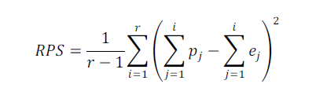
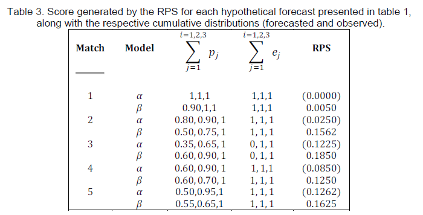
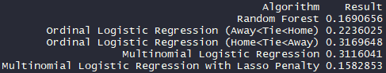

```{r setup, include=FALSE}
knitr::opts_chunk$set(echo = TRUE)
```

## Introduction
Providing the better forecasts for 1x2 bets compared to bookmakers using the odds data and other type information is the aim of the project. 1x2 bets means that match result is home, draw or away. In this project, odds data and matches data are used. The odds data have the information about odds of bookmakers for matches, change date of odds, matches dates; and the matches data have the detailed information of matches such as teams, matches dates, matches results etc.

In this project, building a model is expected to provide predicted probabilities for outcomes of the matches. There are three classes which are “home”, ”tie” and “away” which makes this problem multi-class classification problem.

For the evaluation, this season’s data is used as test data. The start date of test data is 16.08.2018. In addition, test data is started at 15.07.2012.

For this aim, we studied on some regression models, which are random forest algorithm, ordinal logistic regression, multinomial logistic regression and multinomial logistic regression with lasso penalty. By comparing the results of these regressions, we tried to achieve the best result and we focused on the optimization of this model to improve.

## Related literature
### A. Constantinou and N. E. Fenton, "Solving the problem of inadequate scoring rules for assessing," Journal of the Royal Statistical Society, no. Series C: Applied Statistics, August 2011. 
"Summary: Despite the massive popularity of probabilistic (association) football forecasting models, and the relative
simplicity of the outcome of such forecasts (they require only three probability values corresponding to home win,
draw, and away win) there is no agreed scoring rule to determine their forecast accuracy. Moreover, the various
scoring rules used for validation in previous studies are inadequate since they fail to recognise that football outcomes
represent a ranked (ordinal) scale. This raises severe concerns about the validity of conclusions from previous
studies. There is a well-established generic scoring rule, the Rank Probability Score (RPS), which has been missed
by previous researchers, but which properly assesses football forecasting models."

In this article, Constantino & Fenton propose "Rank Probability Score (RPS)" to measure forecasting performances of probabilistic football forecasting models. They mention there is an ordinal relation between the outputs of these forecasts (home win-draw-away win), since there is no way to jump directly from home win to away win, vice versa, there should be time at which the score is a draw.

<center>

</center>

They propose an error measurement based on CDF of the forecasted outcomes and the real outcomes. If we sort the probabilities provided by the bookmakers forecasts, 3 values in [0-1] range, CDF would add up to 1 (100%) as expected. Outcome probabilities are either 0 or 1 since they are the representation of observations of outcomes. In RPS, we calculate the squared error for every CDF point which represents a cumulative error of transition from low level to high level as a factor.


<center>

</center>

### L. A. University of California, "ORDINAL LOGISTIC REGRESSION | R DATA ANALYSIS EXAMPLES" UCLA, [Online]. Available: https://stats.idre.ucla.edu/r/dae/ordinal-logistic-regression/. [Accessed 05 06 2019].
"A study looks at factors that influence the decision of whether to apply to graduate school. College juniors are asked if they are unlikely, somewhat likely, or very likely to apply to graduate school. Hence, our outcome variable has three categories. Data on parental educational status, whether the undergraduate institution is public or private, and current GPA is also collected. The researchers have reason to believe that the “distances” between these three points are not equal. For example, the “distance” between “unlikely” and “somewhat likely” may be shorter than the distance between “somewhat likely” and “very likely”."

At this page, an example of ordinal logistic regression implementation is shown. The order relation between possible outcomes and usage of both numeric and binary independent variables are presents a similarity with our football game prediction problem.

### L. A. University of California, "MULTINOMIAL LOGISTIC REGRESSION | STATA DATA ANALYSIS EXAMPLES" UCLA, [Online]. Available: https://stats.idre.ucla.edu/stata/dae/multinomiallogistic-regression/. [Accessed 05 06 2019].
"Multinomial logistic regression is used to model nominal outcome variables, in which the log odds of the outcomes are modeled as a linear combination of the predictor variables."

At this page, an example of mulyinomial logistic regression implementation is shown. The multiclass structure of the example taken as a similar case for our football game prediction problem.


## Approach
The data sources are described in the beginning of the code. These data sources include functions used in the main part. These data sources are used to ease to use functions. In this project, data sources are named as data_preprocessing, feature_extraction, performance_metrics and train_models. These are called in the following part of the main. 

Data_preprocessing includes the data preparing steps of matches’ data. 
Feature_extraction includes the handling steps of missing data and converge to data with necessary details. 
Performance_metrics includes the functions of ranked probability score calculation. 
Train_models includes functions used in modelling. 

We prepared our data to ready for analysis. Firstly, we assigned the start dates for test and train data. For the test data, we assigned the start date as 16.08.2018 as this season. Moreover, for the train data, 15.07.2012 is assigned to start date. Then, the threshold, which is the parameter for removing bookmaker odds with missing ratio greater than this threshold, is defined as 0.02.

Then, data paths are given odds and matches data, after that these data read from these paths.To extract initial and final odd type features from multiple bookmakers, the feature_extraction data source is called. Then, for setting train features and test features, we divided data based on the provided dates. 

In this project, following regression models are used;

* Random Forest (XgBoost)
* Ordinal Logistic Regression
* Multinomial Logistic Regression
* Multinomial Logistic Regression with Lasso Penalty


### Random forest algorithm
The problem we are trying to solve contains data from different bookmakers. Since every bookmaker's forecasts based on different prior data and profit margin the evaluation of the detailed information is stored in the provided data. Dimensionality is an issue since the training data contains every initial and final odds provided by these bookmakers. RF algorithms can be considered more robust as the dimensions are evaluated based on their impact on performance. 

The RF algorithm tries to find a best combination of decision trees based on their performance to avoid overfit cross validation is implemented. In every fold the performance is evaluated and tried to find best parameters (lambda) to reach an optimum level of prediction performance.


### Ordinal Logistic Regression
Ordinal logistic regression is implemented since we can view the outcomes as in an ordinal relationship. The transition between home win, draw and away win is undeniable. (During the matches outcome cannot change from home win to away win without visiting draw outcome.) This relation may include additional information about the relation between the odds provided by bookmakers & the actual outcomes.

In the ordinal logistic regression, the order of matches’ results (away,tie,home) is important. Because of that, this regression model is repeated for different orders; first one is for Away<Tie<Home, moreover the second one is for Home<Tie<Away. The results of these two regressions are different.

### Multinomial Logistic Regression
The outcomes can be framed as 3 categories as home win, draw and away win. These categories can be used in multinomial logistic regression by using these as unordered levels of dependent variable. 

### Multinomial Logistic Regression with Lasso Penalty
As described in the previous section Multinomial Logistic Regression can be used for predicting the outcomes but overfitting to training data is an issue. To solve this issue adding a penalty factor to error minimization process can be used. At this approach, the level of penalties is hard to define. In order to define this level, trials with different factors coeefficients is used as a heuristic approach.  


## Results
The mean RPS scores for the predictions of all learning algorithms are shown below:

<center>

</center>

The better results are expressed with the minimum error rate, which means minimum RPS score (Result Column). 

## Conclusions and Future Work
The best score belongs to Multinomial Logistic Regression with Lasso Penalty. This result shows us categorical outcome approach with penalty works. Since there is a precaution against overfitting while modeling, test set fairly evaluated and gave better result.

The second best score is resulted from Random Forest. Since the data we are processing is a second hand data, the prior data like the team dominance and team trends belongs to bookmakers, using it with a regression model may not always route to right direction. Bookmakers odds cannot be evaluated as on the same scale. Maybe evaluating these odds as different intervals while taking them as dimensions may improve results.

We assume ordinal evaluation did not fit to problem since the outcome levels (Home win, draw, away win) are not ordered as vertical. Although the direct transition from home to away wins is impossible, there is no high-low relation between these levels. 

As future work;

* The additional information like dominance matrix, trends between seasons, team conditions are assumed to be included hiding in the bookmakers odds. Adding these information as an additional source and testing their direct impact on variance can illuminate a different path for our analysis.
* The number of dimensions compared to the number of observations is relatively high. Different bookmakers calculate their forecasts based on similar data about the teams. this may result a correlation between the dimensions of our training data. Implementing a PCA analysis may decrease the number of features & the variability in the results. 
* In the implementation of worse resulting algorithms all of the training data is used in a single iteration. This approach may be resulted in overfits in these models. Using cross validation may decrease this suspicion by evaluating RPS scores in every fold to maximize gain in the overall outcomes.


## Code
You can find our implementations in our [GitHub](https://github.com/pjournal/etm01-GulnurAcar/tree/master/Project) pages.